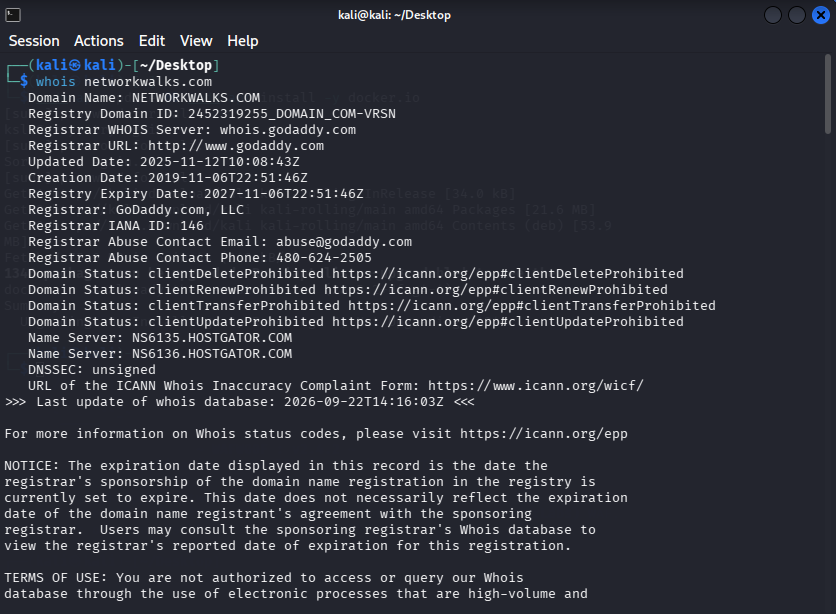
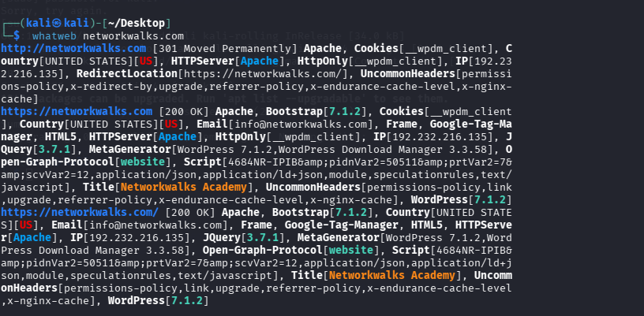
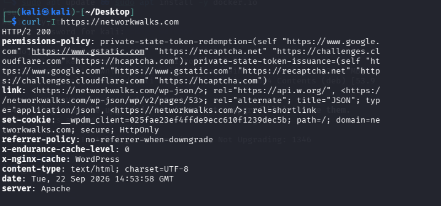
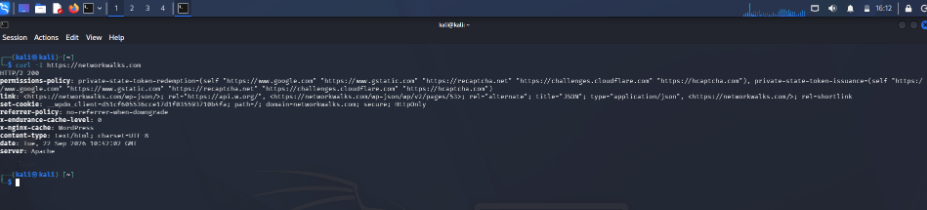
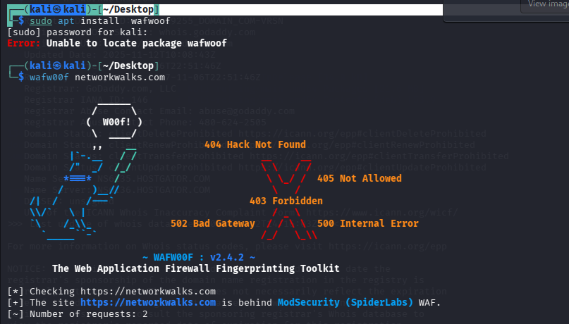
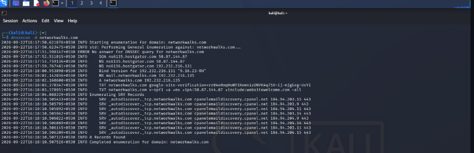

# 🔎 Networkwalks — Week 2
## Footprinting & Reconnaissance

> **Cybersecurity Internship | Practical Security Assessment**

---

## 📌 Overview

As part of my **Networkwalks Cybersecurity Internship**, Week 2 focused on **Footprinting and Reconnaissance**.

The practical work involved gathering publicly observable information from an **authorized target** to understand its domain, DNS infrastructure, web technologies, HTTP behavior, and security controls.

This exercise helped me understand how reconnaissance contributes to building an initial technical picture of a target before deeper security testing.

---

## 🎯 Objectives

- Understand the role of reconnaissance in penetration testing
- Gather publicly available information about an authorized target
- Analyze domain and DNS information
- Identify web technologies
- Inspect HTTP responses and headers
- Detect visible security controls
- Document technical observations with evidence
- Follow responsible and authorized testing practices

---

## 🛠️ Tools Used

| Tool | Purpose |
|---|---|
| **WHOIS** | Domain registration and public domain information |
| **WhatWeb** | Web technology fingerprinting |
| **Nslookup** | DNS and domain resolution |
| **cURL** | HTTP response and header analysis |
| **Wafw00f** | WAF detection |
| **DNSRecon** | DNS enumeration |
| **Wappalyzer** | Browser-based technology identification |

---

# 🔬 Practical Activities

## 01 — WHOIS | Domain Information

WHOIS was used to examine publicly available information associated with the authorized domain.

### Focus

- Domain information
- Registration details
- Publicly available metadata

### Evidence




---

## 02 — WhatWeb | Technology Fingerprinting

WhatWeb was used to identify technologies and web-server information exposed by the target application.

### Focus

- Web technologies
- Frameworks
- Server information
- Technology fingerprints

### Evidence


---

## 03 — Nslookup | DNS Investigation

Nslookup was used to examine domain resolution and obtain DNS-related information.

### Focus

- Domain resolution
- IP information
- DNS responses

### Evidence



---

## 04 — cURL | HTTP Response Analysis

cURL was used to inspect the HTTP response returned by the web server.

### Focus

- HTTP status
- Response headers
- Server information
- HTTP behavior

### Evidence




---

## 05 — Wafw00f | WAF Detection

Wafw00f was used to check whether a detectable Web Application Firewall was present.

### Focus

- WAF identification
- Security-control detection
- Defensive technology visibility

### Evidence




---

## 06 — DNSRecon | DNS Enumeration

DNSRecon was used to perform additional DNS reconnaissance against the authorized target.

### Focus

- DNS records
- DNS infrastructure
- Publicly observable DNS information

### Evidence


---

## 07 — Wappalyzer | Web Technology Analysis

Wappalyzer was used as a browser-based technology identification tool to analyze the technologies detected by the web application.

### Focus

- Web technologies
- Frameworks
- Libraries
- Browser-detected technology indicators

### Evidence


---

# 📊 Observation Summary

| Area | Tool | Purpose |
|---|---|---|
| Domain | WHOIS | Domain intelligence |
| Technology | WhatWeb | Technology fingerprinting |
| DNS | Nslookup | Domain and IP resolution |
| HTTP | cURL | Response and header analysis |
| Protection | Wafw00f | WAF identification |
| DNS | DNSRecon | DNS enumeration |
| Web Stack | Wappalyzer | Technology identification |

> **Note:** Reconnaissance observations should not automatically be considered vulnerabilities. Further authorized validation is required before classifying an observation as a security issue.

---

# 🧭 Reconnaissance Workflow

```text
Authorized Target
       │
       ▼
Domain Information
       │
       ▼
DNS Investigation
       │
       ▼
Technology Fingerprinting
       │
       ▼
HTTP Response Analysis
       │
       ▼
WAF Detection
       │
       ▼
Evidence Collection
       │
       ▼
Technical Documentation
```

---

# 🛡️ Security Perspective

This exercise demonstrated how information exposed through publicly accessible services can provide an external view of an organization's technology environment.

From a defensive perspective, organizations should regularly review:

- Publicly exposed technology information
- DNS records
- HTTP response headers
- Web-server configuration
- Security-control exposure
- Unnecessary information disclosure

---

# 🧠 Key Learnings

Through this week's practical activities, I gained hands-on experience in:

- Footprinting and reconnaissance
- Domain intelligence
- DNS investigation
- Web technology fingerprinting
- HTTP header analysis
- WAF detection
- DNS enumeration
- Browser-based technology identification
- Evidence collection
- Technical documentation
- Responsible security testing

The key takeaway was understanding how **reconnaissance helps establish the technical scope and attack surface before further authorized security testing**.

---

# ⚠️ Responsible Security Testing

All activities documented in this repository are intended for **educational and authorized cybersecurity testing**.

Testing should only be performed against:

- Systems you own
- Authorized lab environments
- CTF platforms
- Targets for which explicit permission has been provided

Unauthorized scanning, enumeration, or testing may violate applicable laws, policies, or terms of service.

---

# 👩‍💻 About Me

**Sankari A.**

Cybersecurity Student | Python | Flask | OWASP | Web Application Security

- GitHub: [sankari-cs](https://github.com/sankari-cs)
- LinkedIn: [Sankari](https://www.linkedin.com/in/sankaria1)

---

## 📌 Internship Learning Series

**Program:** Networkwalks Cybersecurity Internship  
**Week:** 02  
**Focus:** Footprinting & Reconnaissance

This repository documents my practical learning and hands-on cybersecurity activities during the internship.
